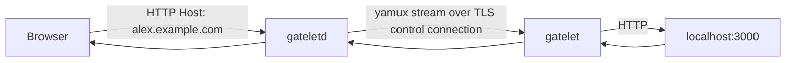

# Gatelet

Gatelet exposes a local HTTP service through a stable public subdomain. It is a small ngrok-style tunnel with two binaries:

| Binary | Purpose |
|---|---|
| `gateletd` | Public relay server that accepts tunnel clients and HTTP traffic |
| `gatelet` | Local client that connects to `gateletd` and forwards requests to a local service |

## Architecture



`gatelet` opens an outbound control connection to `gateletd`, sends its protocol and client version, authenticates with a shared token using a challenge-response handshake, and registers a tunnel name such as `alex`. The `gatelet` CLI uses TLS for this control connection by default. When `gateletd` receives an HTTP request for `alex.example.com`, it opens a stream over the existing tunnel connection and forwards the request to the local client.

## Current Scope

Gatelet currently supports HTTP tunneling only. Public HTTP TLS termination, automatic certificates, persistent account storage, rate limits, and raw TCP forwarding are not implemented yet.

## Requirements

- Go 1.24 or newer
- A server reachable from the internet for public use
- A domain with wildcard DNS for public subdomains

## Installation From Source

Clone the repository and build both binaries:

```sh
go build -o bin/gateletd ./cmd/gateletd
go build -o bin/gatelet ./cmd/gatelet
```

Or install them into your Go binary directory:

```sh
go install ./cmd/gateletd
go install ./cmd/gatelet
```

Make sure your Go binary directory is on `PATH`:

```sh
go env GOPATH
```

The binaries are usually installed into `$(go env GOPATH)/bin`.

## Local Smoke Test

Start a local web service:

```sh
python3 -m http.server 3000 --bind 127.0.0.1
```

Start the relay:

```sh
gateletd --domain example.test --http 127.0.0.1:8080 --control 127.0.0.1:4443 --token dev-token
```

Start the tunnel client:

```sh
gatelet alex --server 127.0.0.1:4443 --to http://127.0.0.1:3000 --token dev-token --control-plaintext
```

Plain client mode prints one line for each completed or failed incoming request:

```text
url https://alex.example.test
target http://127.0.0.1:3000
GET /path?query 200 0B 203.0.113.44
POST /api/items 500 1.4kb 203.0.113.44
```

Use `--log-format jsonl` or `--log-format json` when piping request summaries into tooling. Request records include `method`, `path`, `status`, `request_size`, `remote_ip`, `duration_ms`, and `error` when forwarding fails.

For an interactive local dashboard, add `--tui`:

```sh
gatelet alex --server 127.0.0.1:4443 --to http://127.0.0.1:3000 --token dev-token --control-plaintext --tui
```

Send a request through the relay:

```sh
curl -H 'Host: alex.example.test' http://127.0.0.1:8080/
```

The response should come from the local web service.

## Public Server Setup

Run `gateletd` on a public server:

```sh
gateletd --domain example.com --http :80 --control :4443 --token "$GATELET_TOKEN" \
  --control-tls-cert /etc/letsencrypt/live/example.com/fullchain.pem \
  --control-tls-key /etc/letsencrypt/live/example.com/privkey.pem
```

To avoid exposing the token in process arguments, prefer the environment variable form:

```sh
GATELET_TOKEN="$GATELET_TOKEN" gateletd --domain example.com --http :80 --control :4443
```

Add `--control-tls-cert` and `--control-tls-key` for production control-channel TLS.

Run `gatelet` on your local machine:

```sh
gatelet alex --server relay.example.com:4443 --to http://127.0.0.1:3000 --token "$GATELET_TOKEN"
```

The client also reads `GATELET_TOKEN` when `--token` is omitted. If the control listener uses a private CA or self-signed certificate, pass `--control-ca /path/to/ca.pem`. Use `--control-plaintext` only for trusted local networks or development deployments without control TLS.

Then open:

```text
http://alex.example.com
```

## Compose Deployment

Use `compose.example.yml` for local Docker Compose testing and keep deployment-specific Uncloud values in an ignored `compose.yml`.

The local `compose.yml` in this repository is set up for:

```text
tun.aresa.me
```

That means a tunnel named `alex` is served as:

```text
alex.tun.aresa.me
```

Set a token before starting the service locally:

```sh
export GATELET_TOKEN='replace-with-a-long-random-token'
docker compose -f compose.example.yml up -d --build
```

`compose.example.yml` uses Docker Compose `ports` and publishes the relay on local host ports `8080` and `4443`. It does not configure a control TLS certificate; use `--control-plaintext` for clients that connect to this example deployment.

For Uncloud, deploy the compose file with `uc` from the host or project where you manage services:

```sh
GATELET_TOKEN='replace-with-a-long-random-token' uc deploy -f compose.yml
```

The ignored `compose.yml` uses Uncloud `x-ports`. In Uncloud, public HTTPS traffic is routed by Caddy for `*.tun.aresa.me`, while the client control listener is published directly on host port `4443`:

| Published endpoint | Container port | Purpose |
|---|---|---|
| `*.tun.aresa.me/https` | `8080` | Public HTTPS tunnel traffic via Caddy |
| `4443/tcp@host` | `4443` | Gatelet client control connection |

## DNS Setup

Create wildcard DNS records that point at the public server:

| Record | Type | Value |
|---|---|---|
| `example.com` | `A` or `AAAA` | Public server IP |
| `*.example.com` | `A` or `AAAA` | Public server IP |

Wildcard DNS is required so tunnel names such as `alex.example.com`, `api.example.com`, and `demo.example.com` all reach the relay.

For `tun.aresa.me` on Cloudflare, create records in the `aresa.me` zone:

| Type | Name | Content | Proxy status |
|---|---|---|---|
| `A` or `AAAA` | `tun` | Public server IP | DNS only |
| `A` or `AAAA` | `*.tun` | Public server IP | DNS only |

If Uncloud gives you a hostname instead of a stable IP address, use `CNAME` records instead:

| Type | Name | Content | Proxy status |
|---|---|---|---|
| `CNAME` | `tun` | Uncloud hostname | DNS only |
| `CNAME` | `*.tun` | Uncloud hostname | DNS only |

Use **DNS only** for the current Gatelet deployment. The client control connection uses TCP port `4443`, which is not a normal Cloudflare proxied HTTP origin flow. Put a reverse proxy or Cloudflare Tunnel in front of `gateletd` before enabling Cloudflare proxying.

Cloudflare dashboard path:

1. Open the `aresa.me` zone.
2. Go to **DNS** -> **Records**.
3. Add `tun` and `*.tun` records.
4. Set proxy status to **DNS only**.

Cloudflare API example:

```sh
curl https://api.cloudflare.com/client/v4/zones/$CLOUDFLARE_ZONE_ID/dns_records \
  -H 'Content-Type: application/json' \
  -H "Authorization: Bearer $CLOUDFLARE_API_TOKEN" \
  -d '{
    "type": "A",
    "name": "*.tun.aresa.me",
    "content": "203.0.113.10",
    "ttl": 1,
    "proxied": false
  }'
```

For CLI management, `flarectl` can manage Cloudflare DNS records:

```sh
go install github.com/cloudflare/cloudflare-go/cmd/flarectl@latest
export CF_API_TOKEN='cloudflare-api-token-with-dns-write'
```

Terraform is a better fit if you want DNS as code. Use the official Cloudflare provider and manage `tun.aresa.me` plus `*.tun.aresa.me` as `cloudflare_dns_record` resources.

## Command Reference

### `gateletd`

```sh
GATELET_TOKEN="$GATELET_TOKEN" gateletd --domain example.com --http :80 --control :4443
```

| Flag | Required | Description |
|---|---|---|
| `--domain` | Yes | Base domain used for tunnel subdomains |
| `--http` | No | Public HTTP listen address, default `:8080` |
| `--control` | No | Tunnel control listen address, default `:4443` |
| `--token` | Alternative | Shared authentication token required from clients; prefer `GATELET_TOKEN` in production |
| `--control-tls-cert` | No | PEM certificate chain for TLS on the control listener |
| `--control-tls-key` | No | PEM private key for TLS on the control listener |

### `gatelet`

```sh
gatelet alex --server relay.example.com:4443 --to http://127.0.0.1:3000 --token "$GATELET_TOKEN"
```

| Flag | Required | Description |
|---|---|---|
| positional name | Yes | Tunnel name, for example `alex` |
| `--name` | Alternative | Tunnel name if not using the positional form |
| `--server` | Yes | `gateletd` control address |
| `--to` | Yes | Local HTTP target, with or without `http://` |
| `--token` | Alternative | Shared authentication token; prefer `GATELET_TOKEN` in production |
| `--domain` | No | Public tunnel domain for display, inferred from `--server` when empty |
| `--log-format` | No | Plain-mode output format: `text`, `json`, or `jsonl`; default `text` |
| `--control-plaintext` | No | Disable TLS for the control connection; intended for local development only |
| `--control-ca` | No | PEM CA bundle used to verify the control server certificate |
| `--control-server-name` | No | Override the TLS server name used for control certificate verification |
| `--control-insecure-skip-verify` | No | Use TLS encryption without certificate verification; explicit insecure opt-in |
| `--tui` | No | Show the Bubble Tea live dashboard instead of plain request logs |

Tunnel names must be lowercase DNS labels: letters, numbers, and interior hyphens only.

In TUI mode, `gatelet` shows the public URL, connection status, request history, selected request details, headers, timing, status, errors, and capped text body previews. Press `p` to pause or resume new requests; paused requests wait until resume or timeout. In request detail view, press `r` to replay the selected request to the local target, `y` to copy it as a curl command, and `e` to save the curl command under the Gatelet capture directory.

`gateletd` writes structured text logs for startup, control connections, protocol/client versions, authentication, tunnel registration, incoming requests, tunnel misses, forwards, statuses, durations, byte counts, and forwarding errors.

The relay sets request timeouts and header limits on its public HTTP server. It also overwrites inbound `X-Forwarded-*` headers before forwarding to the local service so public clients cannot spoof the remote IP, original host, or original protocol.

## Operational Notes

- `gateletd` keeps tunnel registrations in memory. Restarting the relay disconnects active tunnels.
- If a second client registers the same name, it atomically replaces the previous tunnel. The old control session is closed and `gateletd` logs the tunnel name plus old and new remote addresses.
- Requests for unknown tunnel names return `404`.
- Broken or unavailable tunnels return `502`.
- Hostnames are matched case-insensitively and may include a trailing dot.
- The forwarded request preserves the original public `Host` header.
- The shared token is not sent directly during tunnel registration; the client proves token knowledge with an HMAC challenge response after the control transport is established.
- The control protocol currently supports protocol version `1`. Unsupported clients receive `ERR unsupported protocol version`.
- The yamux control session uses periodic ping heartbeats. Dead or unresponsive tunnels are closed and removed from the relay session table.

## Development

Run tests:

```sh
go test ./...
```

Run vet:

```sh
go vet ./...
```

Run the Docker E2E smoke test:

```sh
./scripts/e2e-docker.sh
```

The E2E script requires Docker. It builds the image, creates an isolated Docker network, starts `gateletd`, `gatelet`, and a target HTTP service, verifies GET/POST forwarding and unknown-tunnel behavior, then cleans up.

Build both binaries:

```sh
go build -o /tmp/gateletd ./cmd/gateletd
go build -o /tmp/gatelet ./cmd/gatelet
```

## Limitations

- HTTP only; raw TCP tunnels are not supported.
- Public HTTP TLS is not handled by Gatelet yet. Put a reverse proxy such as Caddy, nginx, or HAProxy in front of `gateletd` for HTTPS.
- The control listener only uses TLS when `gateletd` is started with `--control-tls-cert` and `--control-tls-key`. Clients must pass `--control-plaintext` to connect to a raw control listener.
- Authentication is a single shared token.
- There is no reservation database for tunnel names.
- The TUI dashboard is local to one active `gatelet` process; there is no daemon-side management API.
