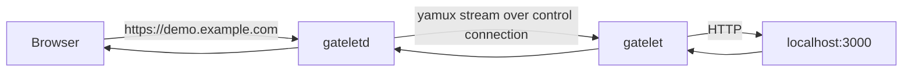

# Gatelet

Gatelet is a small HTTP tunnel for exposing a local web service through a stable public subdomain.

| Binary | Purpose |
|---|---|
| `gateletd` | Public relay daemon. Receives HTTP traffic and tunnel control connections. |
| `gatelet` | Local client. Connects out to `gateletd` and forwards requests to your local target. |

Gatelet is HTTP-only. Raw TCP tunnels are intentionally not supported.

## How It Works



The client opens an outbound control connection, authenticates with a shared token, and registers a tunnel name such as `demo`. Public requests for `demo.example.com` are streamed over that existing connection to the local client.

Control connections can use:

- `wss://example.com/__gatelet/control` through the HTTP listener, recommended for deployment.
- A separate control listener, useful for local development or private networks.

## Install

Build from source:

```sh
go build -o bin/gateletd ./cmd/gateletd
go build -o bin/gatelet ./cmd/gatelet
```

Install from the current checkout:

```sh
go install ./cmd/gateletd
go install ./cmd/gatelet
```

Shell completions are generated by the client:

```sh
gatelet completion bash
gatelet completion zsh
gatelet completion fish
```

Arch Linux users can install the binary package from AUR:

```sh
paru -S gatelet-bin
```

## Quick Start

Start the relay:

```sh
GATELET_TOKEN=dev-token \
  gateletd --domain example.test --http 127.0.0.1:8080 --control 127.0.0.1:4443
```

Start a local target:

```sh
python -m http.server 3000
```

Start a tunnel:

```sh
gatelet demo http://127.0.0.1:3000 \
  --server 127.0.0.1:4443 \
  --token dev-token \
  --control-plaintext
```

Test it:

```sh
curl -H 'Host: demo.example.test' http://127.0.0.1:8080/
```

For a local dashboard:

```sh
gatelet demo http://127.0.0.1:3000 \
  --server 127.0.0.1:4443 \
  --token dev-token \
  --control-plaintext \
  --tui
```

## Public Deployment

Run `gateletd` behind an HTTPS reverse proxy:

```sh
GATELET_TOKEN="$GATELET_TOKEN" \
  gateletd --domain example.com --http :8080
```

Point clients at the WebSocket control endpoint:

```sh
gatelet demo http://127.0.0.1:3000 \
  --server wss://example.com \
  --token "$GATELET_TOKEN"
```

`gatelet` automatically adds `/__gatelet/control` when `--server` is a `ws://` or `wss://` URL without a path.

### Docker Compose

`compose.example.yml` is for local Compose testing:

```sh
export GATELET_DOMAIN=tun.example.com
export GATELET_TOKEN='replace-with-a-long-random-token'
docker compose -f compose.example.yml up -d --build
```

Then use:

```sh
gatelet demo http://127.0.0.1:3000 \
  --server ws://localhost:8080 \
  --domain "$GATELET_DOMAIN" \
  --token "$GATELET_TOKEN"
```

### Uncloud

For Uncloud, keep deployment-specific values in ignored `compose.yml` and use `x-ports`, not Compose `ports`:

```yaml
services:
  gateletd:
    build:
      context: .
    image: gatelet:local
    command:
      - --domain
      - tun.example.com
      - --http
      - :8080
    environment:
      GATELET_TOKEN: ${GATELET_TOKEN:?set GATELET_TOKEN}
      GATELET_ADMIN_USER: ${GATELET_ADMIN_USER:-}
      GATELET_ADMIN_PASSWORD: ${GATELET_ADMIN_PASSWORD:-}
    x-ports:
      - "tun.example.com:8080/https"
      - "*.tun.example.com:8080/https"
```

Deploy:

```sh
uc deploy -f compose.yml --yes
```

The base host serves WebSocket control and admin endpoints. The wildcard host serves tunnel traffic.

### DNS

Create records for the base domain and wildcard:

| Type | Name | Target | Proxy |
|---|---|---|---|
| `A`/`AAAA` or `CNAME` | `tun` | public server or Uncloud hostname | Proxied if using HTTPS routing |
| `A`/`AAAA` or `CNAME` | `*.tun` | public server or Uncloud hostname | Proxied if using HTTPS routing |

With Cloudflare, normal HTTPS and WebSocket traffic can be proxied on port `443`.

## Authentication

The daemon requires a tunnel token.

Single token:

```sh
GATELET_TOKEN='long-random-token' gateletd --domain example.com --http :8080
```

Rotating named tokens:

```sh
GATELET_TOKENS='current=new-token,previous=old-token,retired=oldest-token:inactive' \
  gateletd --domain example.com --http :8080
```

Client with token ID:

```sh
gatelet demo http://127.0.0.1:3000 \
  --server wss://example.com \
  --token "$GATELET_TOKEN" \
  --token-id current
```

Protect a public HTTP tunnel with Basic Auth:

```sh
gatelet demo http://127.0.0.1:3000 \
  --server wss://example.com \
  --token "$GATELET_TOKEN" \
  --basic-auth 'viewer:long-random-password'
```

Gatelet checks Basic Auth at the relay and strips the public `Authorization` header before forwarding to your local target.

## Admin

Enable admin endpoints:

```sh
GATELET_ADMIN_USER=operator \
GATELET_ADMIN_PASSWORD='long-random-password' \
GATELET_TOKEN="$GATELET_TOKEN" \
  gateletd --domain example.com --http :8080
```

Protected endpoints on the base host:

```text
GET /admin              HTML dashboard
GET /__gatelet/status  JSON status
GET /metrics           Prometheus metrics
```

If admin credentials are not configured, these endpoints return `404`.

## CLI Reference

### `gateletd`

```sh
gateletd --domain example.com --http :8080
```

| Flag | Env | Description |
|---|---|---|
| `--domain` | | Public tunnel domain. |
| `--http` | | HTTP listen address, default `:8080`. |
| `--control` | | Optional separate control listener, default `:4443`. |
| `--token` | `GATELET_TOKEN` | Shared tunnel token. |
| `--tokens` | `GATELET_TOKENS` | Comma-separated token rotation spec. |
| `--admin-user` | `GATELET_ADMIN_USER` | Admin Basic Auth username. |
| `--admin-password` | `GATELET_ADMIN_PASSWORD` | Admin Basic Auth password. |
| `--reserved-names` | | Extra tunnel names to reject. |
| `--allow-names` | | Optional allowlist of tunnel names. |
| `--log-format` | | `text` or `json`. |

### `gatelet`

```sh
gatelet demo http://127.0.0.1:3000 --server wss://example.com --token "$GATELET_TOKEN"
```

| Flag | Env | Description |
|---|---|---|
| positional name | | Tunnel name. |
| positional target | | Local HTTP target. |
| `--server` | `GATELET_SERVER` | Control address or `ws(s)` URL. |
| `--token` | `GATELET_TOKEN` | Tunnel token. |
| `--token-id` | `GATELET_TOKEN_ID` | Named token ID, default `default`. |
| `--domain` | | Public domain for display, inferred from `--server` when empty. |
| `--basic-auth` | `GATELET_BASIC_AUTH` | Public tunnel Basic Auth as `user:password`. |
| `--log-format` | | `text`, `json`, or `jsonl`. |
| `--preview-size` | | Body preview cap for logs and TUI. |
| `--inspect` | | Serve a local request inspection and control API. |
| `--inspect-addr` | | Local inspect API bind address, default `127.0.0.1:0`. |
| `--agent` | | Agent mode: enables inspect, JSONL logs, and machine-readable startup metadata. |
| `--tui` | | Run the Bubble Tea request inspector. |

In plain mode, `gatelet` prints the public URL and logs each request. In TUI mode, it shows request history, details, headers, body previews, replay, copy/export helpers, filters, pause/resume, and local target health.

With `--inspect`, `gatelet` prints a local API URL on stderr. The API only binds to loopback addresses. Mutating endpoints require the generated inspect token when one is configured.

```text
GET  /api/capabilities           agent capabilities and endpoint list
GET  /api/status                 tunnel and pause state
GET  /api/events                 server-sent request lifecycle events
GET  /api/requests               captured request list, with filters
GET  /api/requests/{id}          captured request detail
POST /api/requests/{id}/replay   replay a captured request to the local target
POST /api/pause                  pause forwarding new requests
POST /api/resume                 resume forwarding queued requests
GET  /openapi.json               OpenAPI 3.1 description
```

`--agent` is the easiest mode for AI agents and automation:

```sh
gatelet demo http://127.0.0.1:3000 \
  --server wss://example.com \
  --token "$GATELET_TOKEN" \
  --agent
```

Startup is emitted as JSONL and includes `inspect_url`, `inspect_token`, and `capabilities_url`. The same metadata is written to the local agent state file, so agents can prime themselves from the most recent running client:

```sh
gatelet prime
gatelet prime --json
```

`--addr` and `--token` can still be provided explicitly to target a specific running client.

Client-side inspect commands call the local API and print JSON:

```text
gatelet inspect status --addr <url> --token <token>
gatelet inspect capabilities --addr <url> --token <token>
gatelet inspect requests --addr <url> --token <token> --limit 20
gatelet inspect request <id> --addr <url> --token <token>
gatelet inspect replay <id> --addr <url> --token <token>
gatelet inspect pause --addr <url> --token <token>
gatelet inspect resume --addr <url> --token <token>
gatelet inspect wait --addr <url> --token <token> --event request_failed --timeout 30s
gatelet inspect openapi --addr <url> --token <token>
```

When `--addr` or `--token` is omitted, these commands use the most recent local agent state.

`prime` and `inspect` are command words. To use one as a tunnel name, pass it with `--name`:

```sh
gatelet --name inspect http://127.0.0.1:3000 --server wss://example.com --token "$GATELET_TOKEN"
```

## Development

Run checks:

```sh
go test ./...
go vet ./...
go build ./cmd/gatelet ./cmd/gateletd
./scripts/e2e-docker.sh
```

The Docker e2e script builds the image, starts a relay, client, and local HTTP target, verifies forwarding, admin protection, metrics, unknown tunnel behavior, and then cleans up.

## Release

Releases are created from semantic version tags:

```sh
git tag v0.1.0
git push origin v0.1.0
```

The release workflow uses GoReleaser to publish Linux/macOS archives for `gatelet` and `gateletd`. Stable tags also publish the `gatelet-bin` AUR package.

## Limitations

- HTTP tunnels only; raw TCP tunnels are not supported.
- TLS certificates are handled by your reverse proxy, not by Gatelet.
- Tunnel registrations are in memory and are lost when `gateletd` restarts.
- Tunnel names are single-owner while connected; duplicate connections are rejected.
- The TUI is local to one `gatelet` process.
